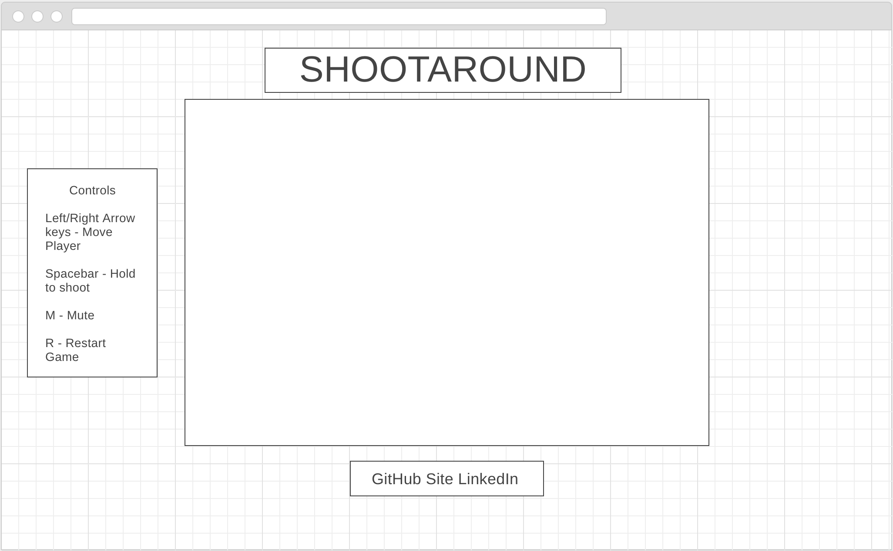

# Set Shooter

[Live](https://purabshah8@github.io/set-shooter)

Basketball shooting game built using JavaScript & HTML5 Canvas. 


## Gameplay

The object of the game is to score as many points as possible until the player misses 3 shots.

The player can move towards or away from the basket using the left/right arrow keys and adjust the angle of the shot using the up/down arrow keys. Hold the spacebar to accumulate power and and release to shoot the ball. Shots behind the 3 point line are worth, you guessed it, 3 points.

## Features

The game uses projectile motion to move ball & collision detection to bounce ball off obstacles.
The power bar increases in size as the spacebar is held down until hitting a predefined maximum power. 

## Physics

The power was calcuated by creating event listeners on keydown & keyup, calculating the time difference with a max of 0.75s, as shown below.

```js
// on keydown
this.startTime = this.startTime || Date.now(); // prevent reset on hold key 

// on keyup
if (this.game.started && !this.game.basketball.isThrown) {
    this.elapsed = (Date.now() - this.startTime)/1000;
    this.elapsed = Math.min(this.elapsed, 0.75);
    this.game.initialVelocites = this.game.basketball.getInitialVelocity(this.elapsed, this.game.shotAngle);
    }
```

 The velocity can then be calculated using projectile motion equations.
 ```js
 // get initial veliocity
 const initialVelocity = time*20;
    return {
        vX: initialVelocity * Math.cos(angle * Math.PI/180),
        vY: initialVelocity * Math.sin(angle * Math.PI/180)
    };
// calculate v(t)
this.x += vX;
this.y -= (vY - (9.81 * time));
 ```

<!-- ## Wireframe

 -->